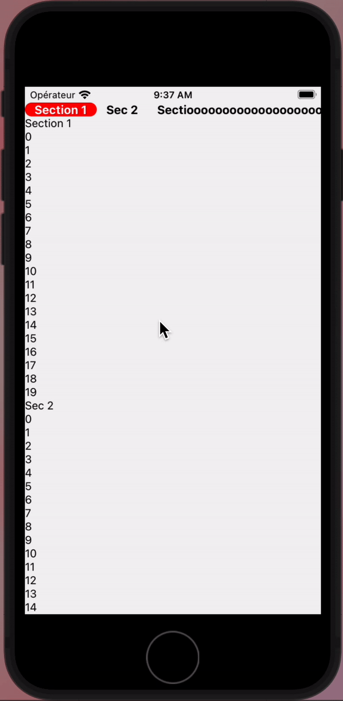
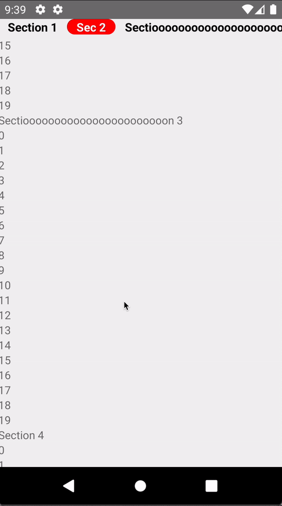

# react-native-sectionlist-deliveroo

---

Components inspired by Deliveroo application.
It provides a [React Native section list](https://reactnative.dev/docs/sectionlist) with its header displaying sections name. The list is bidirectionnal, in the header, you can click on the title of the section you want to go, it'll scroll to the section. Or, has you scroll to the list, it updates the indicator in the header to always follow the section you are visualazing (See demo gifs).

- Works with expo
- Custom styling for the header.
- Each component accepts props of the initial react-native component
- Typescript support

Works for both **Android & IOS**

| IOS                      | Android                      |
| ------------------------ | ---------------------------- |
|  |  |

## [View demo on snack.expo.io](https://snack.expo.io/@riamon-v/react-native-sectionlist-deliveroo)

## Installation

If using yarn:

```shell
$ yarn add react-native-sectionlist-deliveroo
```

If using npm:

```shell
$ npm i react-native-sectionlist-deliveroo
```

---

<!-- ## List of components

* `AnchrableScrollView` which is a component based on react-native Scrollview that calculates positions of Anchors inside and provide a `goToAnchor`function
* `Anchor`which is a component base on react-native View component
* `HeaderAnchors` which is a horizontal scrollview including buttons for each anchor inside the AnchrableScrollView

--- -->

## Usage

```javascript
import SectionListDeliveroo from 'react-native-anchrable-scrollview';
```

Provide the props required for a basic SectionList in React-Native.

##### Basic Usage

```jsx
function App() {
  const data = [
    {
      title: 'Section 1',
      key: 'Section1',
      data: [...Array(20)],
    },
    {
      title: 'Sec 2',
      key: 'Section2',
      data: [...Array(20)],
    },
    {
      title: 'Sectiooooooooooooooooooooooon 3',
      key: 'Section3',
      data: [...Array(20)],
    },
    {
      title: 'Section 4',
      key: 'Section4',
      data: [...Array(20)],
    },
    {
      title: 'Sec 5',
      key: 'Section5',
      data: [...Array(20)],
    },
    {
      title: 'Sectioooooooooooon 6',
      key: 'Section6',
      data: [...Array(20)],
    },
  ];

  return (
    <SectionListDeliveroo
      sections={data}
      renderItem={({ index }) => <Text>{index}</Text>}
      stickySectionHeadersEnabled={false}
      showsVerticalScrollIndicator={false}
      renderSectionHeader={({ section: { title } }) => <Text>{title}</Text>}
      keyExtractor={(_item, index) => `${index}`}
    />
  );
}
```

##### Styling

All Styling props are optionals

| Props                   | Type                                   | Description                                                             | Default values                                                                     |
| ----------------------- | -------------------------------------- | ----------------------------------------------------------------------- | ---------------------------------------------------------------------------------- |
| containerStyle          | `StyleProp<ViewStyle>`                 | Style of the container surrounding the header and the section list      | `none`                                                                             |
| headerContainerStyle    | `StyleProp<ViewStyle>`                 | Style of the container surrounding the header                           | `none`                                                                             |
| headerItemStyle         | `StyleProp<TextStyle>`                 | Style for the text of each item in the header                           | `{`<br>`marginHorizontal: 12,`<br> `fontWeight: 'bold'`,<br> `fontSize: 15`<br>`}` |
| colors                  | `{ active: string, inactive: string }` | Theses properties are the color of the text for each item in the header | `{`<br>`active: "white",`<br> `inactove: "black"`<br>`}`                           |
| indicatorContainerStyle | `StyleProp<ViewStyle>`                 | Style for the indicator                                                 | `{`<br>`backgroundColor: "red",`<br> `borderRadius: 50`<br>`}`                     |

### TroubleShooting

##### ANDROID

- `TypeError: null is not an object (evaluating 'InnerNativeModule.installCoreFunctions')`: [Solution](https://github.com/software-mansion/react-native-reanimated/issues/846#issuecomment-943267584)

#### IOS:

`nothing for now`

### Contributing

Pull requests are always welcome! Feel free to open a new GitHub issue for any changes that can be made.
Keep it simple. Keep it minimal. Don't put every single feature just because you can.

Working on your first Pull Request? You can learn how from this free series How to Contribute to an Open Source Project on GitHub

---

### Authors or Acknowledgments

- Vincent Riamon

### License

This project is licensed under the MIT License
